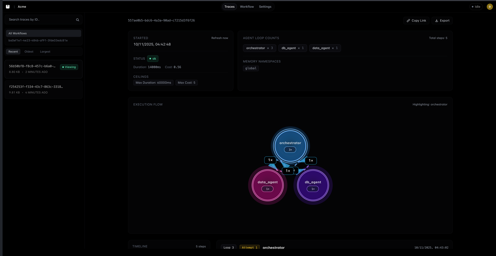

# Echos

**A lightweight multi-agent AI systems.** Stop rebuilding orchestrators, database agents, and retry logic. Just define your workflow in YAML, customize with your data, and ship.

---

## The Problem

Building multi-agent AI systems means rebuilding the same things over and over:

- Orchestrators that route tasks
- Database agents with SQL guardrails  
- Retry logic and backoff strategies
- Loop limiting (preventing rogue agents)
- Cost tracking and observability

**Most frameworks are bulky and complex.** You just want pre-built components you can compose—like AWS services.

---

## The Solution

Echos lets you:

- Coordinate multiple AI agents - Let different agents handle different tasks
- See what's happening - Watch your agents work in real-time
- Debug easily - Visual traces show you exactly what went wrong

Echos gives you **pre-built agent "services"** you compose like AWS:

| What You Need | Echos Agent | What It Does |
|---------------|-------------|--------------|
| Query databases | `db_agent` | SQL with guardrails (no DELETE/DROP) |
| Call HTTP APIs | `api_agent` | SSRF protection, domain whitelisting |
| Search the web | `search_agent` | Serper/Brave integration |
| Analyze data | `data_agent` | Summaries, insights, charts |
| Generate code | `code_agent` | Multi-language code generation |
| Route tasks | `orchestrator` | Intelligent task routing |

Define your "architecture" in YAML (not code):

```yaml
agents:
  - name: orchestrator
    maxLoops: 3
    
  - name: db_agent
    policy:
      guardrails:
        allowedTables: [users, orders]
        allowedOperations: [SELECT]
      retries:
        count: 2
        backoffMs: 300

routes:
  orchestrator:
    canCall: [db_agent, data_agent]
```

---

## Security & Data Privacy

Echos is **local-first** and designed for sensitive data:

- **Your workflow data never leaves your machine** - All execution happens locally
- **Runs on localhost** - No external dependencies required
- **API keys authenticate to YOUR local server** - Not an external service (localhost:4000)
- **Optional external calls** - Only LLM APIs (OpenAI, Anthropic) go external. Use local models (Ollama) for complete data isolation
- **Multi-tenant ready** - Organization isolation built-in

**For Production:**

- Self-host in your VPC using Docker/Docker Compose
- Perfect for HIPAA, SOC2, and compliance requirements
- Deploy to any infrastructure (AWS, GCP, Azure, Railway)
- Your data never touches our servers

---
Use anywhere:

```typescript
import { EchosRuntime } from '@echoshq/runtime';

const runtime = new EchosRuntime({ 
  apiKey: process.env.ECHOS_API_KEY,
  apiUrl: process.env.ECHOS_API_URL || 'http://localhost:4000'
  workflow: './workflow.yaml' // optional, defaults to 'workflow.yaml'
});

// Simple usage
await runtime.run('Analyze Q4 sales by region');

// Or with memory context
await runtime.run({
  task: 'Analyze Q4 sales by region',
  memory: { year: 2024, region: 'north' }
});
```

---

## Time-Travel Debugging

When an agent fails in production, you can now:

1. Click the failed trace
2. Click **"Time Travel Debug"**
3. Edit the workflow config right there
4. See what WOULD have happened with your changes
5. Deploy the fix instantly

**You just fixed 47 production failures in 5 minutes.**

This is like Chrome DevTools time-travel debugging, but for AI agents.

---

## One-Click Agent from OpenAPI Spec

** Paste any OpenAPI spec → instant production-ready agent.

Click **"Generate from OpenAPI"** in the UI, paste a Stripe, GitHub, or any API spec, and get:

- ✅ **Auto-configured guardrails** - Domain allowlisting, SSRF protection
- ✅ **All endpoints mapped** - Complete API documentation in agent memory
- ✅ **Auth detection** - Bearer, API Key, OAuth2 automatically configured
- ✅ **Instant deployment** - Preview, customize, and save in seconds

**Example:**

```bash
# Paste this URL:
https://raw.githubusercontent.com/stripe/openapi/master/openapi/spec3.json

# Get a Stripe agent that can:
✓ Create customers
✓ Process payments
✓ Manage subscriptions
✓ Handle refunds
# All with natural language!
```

Turn **any API into a natural language interface** in under 30 seconds.

---

## Community & Support

Join our Discord community for discussions, support, and updates:

[](https://discord.gg/KqdBcqRk5E)

---

## Dashboard



---

## Features

- **Time-Travel Debugging** - Click any failed trace → Edit config → Test the fix → Deploy. Fix production issues in 60 seconds.
- **Cost Estimation & Warnings** - See estimated costs before running workflows. Get warned about high-cost operations (>$0.10)
- **Loop Limiting** - Set `maxLoops` per agent to prevent infinite loops
- **Retry Logic** - Automatic retries with exponential backoff
- **Cost Ceilings** - Per-agent and per-workflow cost limits
- **Memory Management** - Agents share context through namespaced memory
- **Multi-LLM** - OpenAI (GPT-3.5, GPT-4, GPT-4o) or Anthropic (Claude)
- **Visual Traces** - See what happened, where it failed, and costs
- **Guardrails** - SQL injection protection, SSRF blocking, table/domain whitelisting
- **Environment Validation** - Automatic checks for Docker, Node.js, and dependencies on startup

---

## Quick Start (100% Local)

Everything runs on your machine—no external services required.

```bash
# 1. Start Echos locally (validates environment, starts PostgreSQL + server + web UI)
git clone https://github.com/treadiehq/echos.git
cd echos
./start.sh  # Or: npm install && npm run start
# start.sh automatically checks for Docker, Node.js, and installs dependencies

# 2. Create account at http://localhost:3000/signup
# Get your API key (authenticates to YOUR local server at localhost:4000)

# 3. Install in your project
npm install @echoshq/runtime

# 4. Initialize your workflow (2-minute setup)
npx echos init

# Choose from pre-built templates:
# Customer Support - Database + Search + Analysis
# Stripe Billing - API Integration + Analysis  
# Data Analyst - SQL + Analysis
# Custom - Build your own

# 5. Run your agent
npx echos "Analyze customer sentiment from database"

# Or use in code
import { EchosRuntime } from '@echoshq/runtime';

const runtime = new EchosRuntime({
  apiKey: process.env.ECHOS_API_KEY,
  apiUrl: process.env.ECHOS_API_URL || 'http://localhost:4000'
  workflow: './workflow.yaml'  // optional
});

await runtime.run('Your task');
```

View traces at <http://localhost:3000>

---

## Deployment Options

### Local Development (Default)

```bash
./start.sh  # Everything on localhost - your data stays local
```

### Self-Hosted Production

```bash
# Option 1: Docker Compose (recommended)
docker-compose up -d

# Option 2: Deploy to your infrastructure
# Works with Railway, AWS ECS, GCP Cloud Run, Azure, Kubernetes
# Your Echos instance runs in YOUR environment
```

**Need help with production deployment?** Join our [Discord](https://discord.gg/KqdBcqRk5E) for support.

---

## Docs

- **[Memory](docs/MEMORY.md)** - How agents share context
- **[Embedding](docs/EMBEDDING.md)** - Integrate into your app
- **[Examples](examples/README.md)** - Pre-built templates
- **[workflow.yaml](workflow.yaml)** - Configuration reference

---

## Commands

| Command | Description |
|---------|-------------|
| `./start.sh` | Start Echos locally (PostgreSQL + server + web) |
| `./stop.sh` | Stop everything |
| `./restart.sh` | Restart everything |
| `npx echos init` | Initialize a new workflow with templates |
| `npx echos "task"` | Run a task with your agents |
| `npx echos --help` | Show CLI help |

---

## License

FSL-1.1-MIT - See [LICENSE](LICENSE)
